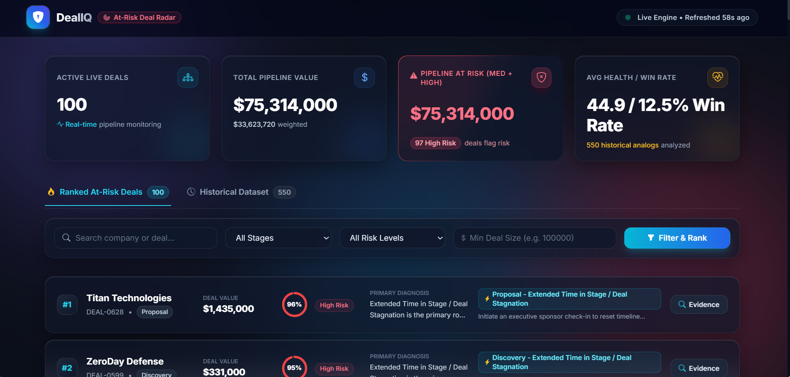

<a name="readme-top"></a>

<p align="center">
  
</p>

<h1 align="center">DealIQ — AI-Powered At-Risk Deal Radar 🎯</h1>

<p align="center">
  <i>An AI-powered sales intelligence platform for identifying at-risk deals, explaining risk factors, and recommending data-driven actions</i>
</p>

<p align="center">
  
  
  
  
  
  
  
  
</p>

<p align="center">
  <a href="https://dealiq-at-risk-deal-rader-zcwe.onrender.com/">
    
  </a>
</p>

**DealIQ** is an AI-powered sales intelligence platform that identifies at-risk deals, explains the underlying risk factors, retrieves similar historical deals, determines the primary root cause, and recommends the next best action.

DealIQ combines machine learning, deterministic business rules, historical analog retrieval, explainable risk factors, and live pipeline analytics into a single decision-support platform for sales teams.

## Table of Contents
- [🚀 What DealIQ Does](#-what-dealiq-does)
- [🎯 Core Features](#-core-features)
- [🏗️ Project Structure](#️-project-structure)
- [🧰 Technology Stack](#-technology-stack)
- [📡 API Endpoints](#-api-endpoints)
- [📋 Installation & Running](#-installation--running)
- [🤖 ML Risk Scoring](#-ml-risk-scoring)
- [🧠 Explainable Risk Signals](#-explainable-risk-signals)
- [🔎 Historical Deal Analogs](#-historical-deal-analogs)
- [⏳ WHY NOT WAIT](#-why-not-wait)
- [🎯 Deterministic Root Cause Engine](#-deterministic-root-cause-engine)
- [🧩 Examples & Dashboard](#-examples--dashboard)
- [🏗️ System Architecture](#️-system-architecture)
- [🧪 Automated Testing](#-automated-testing)
- [⚠️ Current ML Limitation](#-current-ml-limitation)
- [✅ Validation Status](#-validation-status)
- [🏆 Key Differentiator](#-key-differentiator)
- [🔌 Salesforce Integration](#-salesforce-integration)
- [🤝 Contributing](#-contributing)
- [👥 Team](#-team)
- [🙏 Acknowledgments](#-acknowledgments)
- [📜 License](#-license)

## 🚀 What DealIQ Does

Sales teams often know that a deal is "going bad" only after the opportunity is already lost.

DealIQ aims to answer four questions before that happens:

- **Which deals are at risk?**
- **Why are they at risk?**
- **What caused the risk?**
- **What should the sales team do next?**

For every active deal, DealIQ evaluates:

- Stage velocity
- Buyer response latency
- Buyer sentiment
- Stakeholder coverage
- Competitor presence
- Scope changes
- Deal value
- Historical deal similarity

The system then produces:

**Risk Score → Risk Signals → Root Cause → Recommended Action → Historical Evidence**

<p align="right">(<a href="#readme-top">⬆ Back to top</a>)</p>

## 🎯 Core Features

### 1. AI At-Risk Deal Detection

DealIQ uses a calibrated machine-learning classifier to estimate the probability that a live deal is AT-RISK.

The system uses a:
- **Calibrated Random Forest Classifier**
  - `n_estimators = 100`
  - `max_depth = 5`
  - `class_weight = "balanced"`
  - Sigmoid probability calibration

The model produces a risk probability that is used by the DealIQ risk engine.

### 2. Explainable Health Score

DealIQ maintains a separate deterministic Health Score from 0–100.

The Health Score is intentionally separate from the ML Risk Score.

Health Score = 50 + contributions, then clamp to 0–100

It evaluates six observable operational factors:

| Factor | Positive/Negative Contribution |
|--------|------------------------------|
| Stage Velocity | ±10 |
| Response Latency | ±10 |
| Sentiment Trend | ±10 |
| Stakeholder Coverage | ±10 |
| Competitor Presence | ±5 |
| Scope Stability | ±5 |

The score starts from a baseline and is adjusted according to explicit business rules.

#### Stage Velocity Benchmarks

| Stage | Target |
|-------|--------|
| Discovery | ≤ 14 days |
| Qualification | ≤ 21 days |
| Evaluation | ≤ 30 days |
| Proposal | ≤ 30 days |
| Negotiation | ≤ 21 days |
| Closing | ≤ 14 days |

**Example:** A deal in Qualification for 148 days against a benchmark of ≤21 days receives a significant Stage Velocity penalty.

This makes the Health Score transparent and directly traceable to observable deal behavior.

<p align="right">(<a href="#readme-top">⬆ Back to top</a>)</p>

## 🏗️ Project Structure

```
TEAM-SHAKTHI-BUILD-SPRINT-HACKATHON/
├── main.py                      # FastAPI application and endpoints
├── api_router.py               # API router for data sources
├── deal_scorer.py              # ML-based risk scoring engine
├── recommendation_engine.py    # Recovery recommendation system
├── feature_extractor.py        # NLP engagement feature extraction
├── test_app.py                 # Comprehensive test suite (15 tests)
├── requirements.txt            # Python dependencies
├── .env.example               # Environment variables template
├── .gitignore                 # Git ignore rules
├── data/                      # Data directory
│   ├── live_deals.json        # Current pipeline deals (100 deals)
│   └── historical_deals.json  # Historical outcomes (550 deals)
├── data_sources/              # CRM integration providers
│   ├── base.py               # Base provider interface
│   ├── file_import.py        # File-based data import
│   ├── hubspot.py            # HubSpot CRM integration
│   ├── normalizer.py         # Data normalization utilities
│   ├── provider_factory.py   # Provider factory pattern
│   ├── salesforce.py         # Salesforce CRM integration
│   └── synthetic.py          # Synthetic data generator
└── static/                    # Frontend assets
    └── index.html            # Web dashboard
```

<p align="right">(<a href="#readme-top">⬆ Back to top</a>)</p>

## 🧰 Technology Stack

### Backend
- Python
- FastAPI
- REST APIs

### Machine Learning
- Scikit-learn
- NumPy
- Pandas
- Random Forest
- CalibratedClassifierCV
- Stratified K-Fold Cross-Validation
- Probability Calibration
- k-Nearest Neighbors
- Euclidean Distance
- Feature Normalization

### Frontend
- HTML
- CSS
- JavaScript
- Dashboard-based UI

### Testing
- Python unittest
- Automated regression tests

<p align="right">(<a href="#readme-top">⬆ Back to top</a>)</p>

## 📡 API Endpoints

### **GET /** 
- **Description**: Main web interface
- **Returns**: HTML dashboard or API status message

### **GET /api/metrics**
- **Description**: Pipeline-level metrics and statistics
- **Response**: Pipeline value, risk breakdown, health scores, win rates

### **GET /api/deals/live**
- **Description**: Retrieve all live deals with full analysis
- **Query Parameters**: stage, risk_level, min_size
- **Response**: Array of processed deals with health scores, risk assessments, and recommendations

### **GET /api/deals/historical**
- **Description**: Retrieve historical deals for analysis
- **Query Parameters**: stage, outcome, min_size
- **Response**: Array of historical deals with health scores

### **POST /api/extract-features**
- **Description**: Extract engagement features from deal text
- **Request Body**: Deal record with transcript/email text
- **Response**: Structured engagement feature vector

<p align="right">(<a href="#readme-top">⬆ Back to top</a>)</p>

## 📋 Installation & Running

### Prerequisites
- Python 3.9 or higher
- pip package manager

### Setup Steps

1. **Clone the repository**
```bash
git clone <repository-url>
cd TEAM-SHAKTHI-BUILD-SPRINT-HACKATHON
```

2. **Install dependencies**
```bash
pip install -r requirements.txt
```

3. **Set up environment variables (optional)**
```bash
# For LLM-powered feature extraction
cp .env.example .env
# Edit .env and add your OPENAI_API_KEY
```

4. **Verify data files**
Ensure the following files exist in the `data/` directory:
- `live_deals.json` - Current pipeline deals
- `historical_deals.json` - Historical deal outcomes

### Running DealIQ

1. **Start the Backend**
```bash
uvicorn main:app --reload
```

2. **Open the Application**

Open the frontend/dashboard URL configured by the project (typically `http://127.0.0.1:8000`)

<p align="right">(<a href="#readme-top">⬆ Back to top</a>)</p>

## 🤖 ML Risk Scoring

### Training Methodology

The historical dataset contains **550 historical deals**.

The dataset is split using an **80/20 stratified train/holdout split**:

| Split | Deals |
|-------|-------|
| Training | 440 |
| Holdout | 110 |
| Total | 550 |

The training split is further evaluated using **5-Fold Stratified Cross-Validation**.

This prevents threshold selection from being based directly on the unseen holdout set.

<p align="right">(<a href="#readme-top">⬆ Back to top</a>)</p>

### ⚖️ Class Imbalance

The historical dataset contains a strong concentration of unsuccessful deals.

Approximately **481 / 550 = 87.5%** of historical deals are STALLED or LOST.

This imbalance caused the original uncalibrated Random Forest probabilities to become highly concentrated toward high-risk values.

DealIQ therefore uses probability calibration to improve the quality of the predicted probabilities.

**Model Selection:** Calibrated Random Forest was selected as the production model based on the best overall trade-off between discrimination and probability quality. While the uncalibrated Random Forest achieved slightly higher ROC-AUC (0.7284 vs. 0.7232) and PR-AUC (0.9403 vs. 0.9401), its probability quality was substantially worse, with a Brier Score of 0.1358 and ECE of 0.1904. Sigmoid calibration reduced these to 0.1035 and 0.0655 respectively, making the calibrated model more suitable for probability-based risk scoring.

### 🎯 Decision Threshold

The production decision threshold was selected using 5-Fold Stratified Cross-Validation on the training set.

**Candidate thresholds:** 0.30, 0.50, 0.60, 0.70, 0.75, 0.80, 0.85

The selected production threshold is: **τ = 0.80**

The selection prioritizes Matthews Correlation Coefficient (MCC) while maintaining strong at-risk recall.

#### Threshold Comparison

| Threshold | Recall | Specificity | MCC |
|-----------|--------|-------------|-----|
| 0.50 | 99.48% | 1.82% | 0.0522 |
| 0.60 | 98.70% | 7.27% | 0.1396 |
| 0.70 | 96.62% | 16.36% | 0.1971 |
| 0.75 | 95.06% | 21.82% | 0.2182 |
| **0.80** | **90.39%** | **38.18%** | **0.2793** |
| 0.85 | 78.96% | 50.91% | 0.2288 |

**Why 0.80?**

- At 0.50, the model identifies almost every at-risk deal but incorrectly classifies almost every WON deal as risky.
- At 0.85, specificity improves, but at-risk recall falls significantly.
- **Thus, 0.80 was selected as the optimal threshold among the evaluated candidate thresholds, maximizing MCC while retaining approximately 90% sensitivity.**

### Decision Threshold vs. Dashboard Risk Bands

DealIQ uses two related but distinct concepts:

**ML Decision Threshold**
- τ = 0.80
- Used for binary model evaluation: WON vs. AT-RISK
- Selected through 5-Fold Stratified Cross-Validation using MCC

**Dashboard Risk Bands**
- High Risk: ≥ 60/100
- Medium Risk: 35–59.99/100
- Low Risk: < 35/100
- Used for pipeline prioritization and visualization

The dashboard risk bands should therefore not be interpreted as the model's optimized binary classification threshold.

**Important:** The Risk Score is the calibrated model probability expressed on a 0–100 operational scale. Dashboard risk bands (High ≥60, Medium 35–59.99, Low <35) are prioritization categories and are intentionally separate from the ML binary decision threshold (τ=0.80).

### 📊 Holdout Evaluation

The selected model and threshold were evaluated on an unseen holdout set of 110 deals.

| Metric | Result |
|--------|--------|
| ROC-AUC | 0.7232 |
| PR-AUC | 0.9401 |
| Balanced Accuracy | 69.79% |
| MCC | 0.3650 |
| Precision | 92.47% |
| Recall / Sensitivity | 89.58% |
| Specificity | 50.00% |
| F1 Score | 0.9101 |
| Brier Score | 0.1035 |
| Brier Skill Score | +0.0679 |
| ECE | 0.0655 |

#### Holdout Confusion Matrix

| | Predicted WON | Predicted AT-RISK |
|---|---------------|------------------|
| **Actual WON** | 7 | 7 |
| **Actual AT-RISK** | 10 | 86 |

The model therefore identifies **86 of 96 at-risk deals** in the holdout set.

### 📐 Probability Calibration

DealIQ uses **Sigmoid probability calibration** on the Random Forest classifier.

Calibration quality is monitored using:

- **Brier Score**: 0.1035, improving over the holdout prevalence baseline of approximately 0.1111, corresponding to a Brier Skill Score of +6.79%
- **Brier Skill Score**: +0.0679 (indicating improvement over the prevalence-based baseline)
- **Expected Calibration Error**: ECE = 0.0655 (~6.55%)

The calibration layer is intended to make the model's probability outputs more useful as risk estimates rather than relying on raw tree-leaf probabilities.

**Note:** The historical dataset contains 481/550 unsuccessful deals (87.5%), which creates substantial class imbalance in the demonstration dataset.

<p align="right">(<a href="#readme-top">⬆ Back to top</a>)</p>

## 🧠 Explainable Risk Signals

DealIQ does not simply output: *"This deal is risky."*

It identifies the strongest contributing risk signals.

**Example: Radiant Systems**
- Deal: DEAL-0613
- Stage: Discovery
- Deal Value: $793,000
- Risk Score: 96/100
- Health Score: 2/100

**Primary risk signals:**
- Single-Threaded Relationship — 35%
- Competitor Presence — 35%
- Elevated Response Latency — 30%

**Additional risk factors:**
- Scope instability
- Extended time in stage
- Declining sentiment

This provides sales teams with an actionable explanation rather than a black-box prediction.

<p align="right">(<a href="#readme-top">⬆ Back to top</a>)</p>

## 🔎 Historical Deal Analogs

DealIQ uses **k-Nearest Neighbors (k-NN)** to retrieve historically similar deals.

The similarity engine uses:
- 7 normalized features
- Euclidean distance
- k = 5
- Self-exclusion

The system compares a live deal against historical deals to provide contextual evidence.

**For example:**

**Current Deal:** 148 days in Qualification

**Historical Analogs:**
- 143 days → STALLED
- 178 days → STALLED
- 127 days → WON
- 135 days → LOST
- 112 days → LOST

This helps answer: *"Have similar deals historically succeeded or failed?"*

**Note:** Historical analogs provide contextual evidence and are not treated as causal predictions.

<p align="right">(<a href="#readme-top">⬆ Back to top</a>)</p>

## ⏳ WHY NOT WAIT

Historical analogs are also used to generate the WHY NOT WAIT explanation.

The engine evaluates the exact set of returned nearest analogs.

**For example, for Hyperion Systems:**

- Analog durations: 143, 178, 127, 135, 112 days
- Threshold: 112 days
- Result: **5/5 spent at least 112 days in Qualification.**

The calculation uses `days_in_stage >= threshold_days` and the denominator is dynamically based on the number of returned analogs.

This prevents misleading statements such as "4/5" when all five displayed analogs actually satisfy the duration condition.

<p align="right">(<a href="#readme-top">⬆ Back to top</a>)</p>

## 🎯 Deterministic Root Cause Engine

DealIQ separates **Risk Detection** from **Root Cause Determination**.

The root cause engine was specifically designed to prevent contradictions between displayed risk signals and recommendations.

**The invariant is:**
```
primary_root_cause == highest_ranked_primary_risk_signal
```

The system therefore follows:
```
Primary Risk Signal
        ↓
Deterministic Root Cause Mapping
        ↓
Recommended Action
        ↓
WHY THIS MOVE
        ↓
WHY NOT WAIT
```

### 🛠️ Root Cause Categories

The recommendation engine maps primary risk signals to deterministic action plans.

**Examples include:**

**Lack of Stakeholder Alignment**
- Signal: Stakeholders involved < 3
- Action: Initiate check-in with additional key contacts to expand multi-threaded account coverage.

**Extended Time in Stage / Deal Stagnation**
- Signal: Days in stage > stage benchmark
- Action: Initiate an executive sponsor check-in to reset timeline expectations and re-validate business priorities.

**Competitive Pressure**
- Signal: Competitor mentions detected
- Action: Deploy a differentiated value matrix highlighting unique capabilities against competing vendors.

**Scope Instability**
- Signal: Scope changes detected
- Action: Freeze custom scope additions and package a baseline Phase 1 implementation offer.

**Procurement Delay**
- Signal: Late-stage commercial/procurement friction
- Action: Review commercial and procurement alignment with relevant stakeholders to clear contracting bottlenecks.

<p align="right">(<a href="#readme-top">⬆ Back to top</a>)</p>

## 🧩 Examples & Dashboard

### Example: Titan Technologies

<p align="center">
  
  
  
  
</p>

*Screenshot showing DealIQ's complete analysis for Titan Technologies: Risk Score (96/100), Health Score (30/100), Health Factors, Ranked Risk Signals, Root Cause, Recommended Action, and Historical Evidence.*

### DealIQ Dashboard

<p align="center">
  
</p>

*Screenshot showing DealIQ's main dashboard with pipeline overview, risk classification, and key metrics.*

The main dashboard provides a live pipeline overview.

### Current Dataset Snapshot

The demo dataset contains:
- **100 active live deals**
- **550 historical deals**

The dashboard provides:
- Active Live Deals
- Total Pipeline Value
- Pipeline At Risk
- Weighted Pipeline Value (calculated as Σ(deal value × estimated probability of success), where probability of success = 1 − calibrated AT-RISK probability)
- Average Health Score
- Win Rate
- Ranked At-Risk Deals
- Historical Dataset Count

### 📈 Risk Classification

Live deals are classified using risk-score bands:

| Risk Category | Score |
|---------------|-------|
| 🔴 High Risk | ≥ 60 |
| 🟡 Medium Risk | 35–59.99 |
| 🟢 Low Risk | < 35 |

The dashboard's **Pipeline At Risk (Med + High)** represents the aggregate value of live deals classified as Medium or High Risk.

This uses the same risk classification source of truth as the deal-level filtering.

**Note:** The current dataset is heavily imbalanced toward unsuccessful historical outcomes (87.5%) and produces an unusually high proportion of high-risk live deals in the demonstration pipeline. In the current synthetic/demo dataset, all 100 active deals fall above the dashboard's Medium Risk cutoff of 35/100, resulting in 100% of pipeline value being categorized as Medium or High Risk. These figures should not be interpreted as general population estimates.

<p align="right">(<a href="#readme-top">⬆ Back to top</a>)</p>

## 🏗️ System Architecture

```
                 ┌──────────────────────┐
                 │     Live Deals       │
                 └──────────┬───────────┘
                            │
                            ▼
                 ┌──────────────────────┐
                 │ Feature Engineering  │
                 └──────────┬───────────┘
                            │
              ┌─────────────┴─────────────┐
              │                           │
              ▼                           ▼
     ┌─────────────────┐        ┌──────────────────┐
     │  Health Score   │        │   ML Risk Model  │
     │  0–100          │        │ Calibrated RF    │
     └────────┬────────┘        └────────┬─────────┘
              │                          │
              └────────────┬─────────────┘
                           ▼
                 ┌──────────────────────┐
                 │ Ranked Risk Signals  │
                 └──────────┬───────────┘
                            │
             ┌──────────────┴──────────────┐
             │                             │
             ▼                             ▼
   ┌─────────────────────┐       ┌───────────────────┐
   │ Root Cause Engine   │       │ k-NN Analog Engine│
   │ Deterministic       │       │ k = 5             │
   └──────────┬──────────┘       └─────────┬─────────┘
              │                            │
              └────────────┬───────────────┘
                           ▼
                 ┌──────────────────────┐
                 │ Recommendation Engine│
                 └──────────┬───────────┘
                            │
                            ▼
                 ┌──────────────────────┐
                 │     DealIQ UI        │
                 │ Risk + Explanation   │
                 │ + Recommended Action │
                 └──────────────────────┘
```

<p align="right">(<a href="#readme-top">⬆ Back to top</a>)</p>

## 🧪 Automated Testing

DealIQ currently contains **15 / 15 automated tests passing**.

Run:
```bash
python -m unittest test_app.py
```

**Current test suite:** 15/15 passing

The test suite covers critical system behavior including:
- Health Score validation
- ML risk scoring
- Calibration metrics
- Threshold validation
- Cross-validation structure
- Historical analog retrieval
- Self-exclusion
- Root cause alignment
- Recommendation compatibility
- WHY THIS MOVE generation
- WHY NOT WAIT evidence
- Analog duration counting
- Dashboard-related behavior
- Regression scenarios

<p align="right">(<a href="#readme-top">⬆ Back to top</a>)</p>

## ⚠️ Current ML Limitation

The ROC-AUC of 0.7232 indicates moderate discrimination, meaning the model can distinguish many at-risk deals from successful deals but does not provide perfect separation. The moderate ROC-AUC reflects overlap in the feature distributions between WON and unsuccessful deals. The relatively small dataset and strong class imbalance also limit the reliability and generalizability of performance estimates.

**Note:** Because the positive class prevalence is approximately 87.5%, PR-AUC should be interpreted relative to this high baseline prevalence rather than in isolation.

This is expected given the overlap between WON and unsuccessful outcomes in the underlying historical dataset.

However, the model demonstrates strong precision/recall characteristics on the holdout set and is supported by:
- Probability calibration
- Cross-validation
- Threshold optimization
- Holdout evaluation
- Explainable risk factors
- Historical analog evidence
- Deterministic recommendation logic

DealIQ should therefore be viewed as a decision-support system, not an autonomous replacement for sales judgment.

<p align="right">(<a href="#readme-top">⬆ Back to top</a>)</p>

## ✅ Validation Status

| Component | Status |
|-----------|--------|
| Health Score | 🟢 Validated |
| ML Risk Scoring | 🟢 Validated |
| Probability Calibration | 🟢 Validated |
| Decision Threshold | 🟢 Validated |
| 5-Fold CV | 🟢 Validated |
| Unseen Holdout | 🟢 Validated |
| Brier Skill Score | 🟢 Validated |
| ECE | 🟢 Validated |
| k-NN Historical Analogs | 🟢 Validated |
| Self-Exclusion | 🟢 Validated |
| Root Cause Alignment | 🟢 Validated |
| Recommendation Mapping | 🟢 Validated |
| WHY THIS MOVE | 🟢 Validated |
| WHY NOT WAIT | 🟢 Validated |
| Dashboard Aggregation | 🟢 Validated |
| Risk Classification | 🟢 Validated |
| Automated Tests | 🟢 15/15 Passed |


## 🏆 Key Differentiator

Traditional dashboards answer: *"Which deals are at risk?"*

DealIQ goes further: *"Which deals are at risk, why are they at risk, what is the primary root cause, what should we do next, and what happened to similar historical deals?"*

The core decision pipeline is:

```
LIVE DEAL
   ↓
FEATURE ANALYSIS
   ↓
ML RISK SCORE
   +
HEALTH SCORE
   ↓
RANKED RISK SIGNALS
   ↓
ROOT CAUSE
   ↓
RECOMMENDED ACTION
   ↓
HISTORICAL ANALOG EVIDENCE
   ↓
WHY THIS MOVE
   ↓
WHY NOT WAIT
```

<p align="right">(<a href="#readme-top">⬆ Back to top</a>)</p>

## 🔌 Salesforce Integration

**Status:** Integration framework implemented; live synchronization is a deployment capability not included in current demo.

DealIQ can be integrated with Salesforce to provide live deal intelligence directly within your CRM environment.

### Integration Benefits

- **Live Risk Alerts**: Get notified when Salesforce opportunities become at-risk
- **AI-Powered Recommendations**: Receive actionable recovery suggestions directly in Salesforce
- **Historical Context**: View similar historical deals from Salesforce closed opportunities
- **CRM Workflow Integration**: Surface DealIQ insights within Salesforce once live synchronization is enabled

### Integration Options

#### Option 1: Salesforce Connected App
Create a Connected App in Salesforce to enable OAuth 2.0 authentication:

1. Navigate to **Setup → App Manager → New Connected App**
2. Enable OAuth settings with appropriate scopes
3. Configure callback URL for DealIQ
4. Obtain Consumer Key and Consumer Secret

#### Option 2: Salesforce REST API
Use Salesforce REST API to fetch opportunity data:

```python
# Example integration configuration
SALESFORCE_CONFIG = {
    "instance_url": "https://your-instance.salesforce.com",
    "api_version": "<supported Salesforce API version>",
    "client_id": "your_consumer_key",
    "client_secret": "your_consumer_secret"
}
```

### Data Mapping

| DealIQ Field | Salesforce Field |
|--------------|-----------------|
| Deal ID | Opportunity ID |
| Company Name | Account Name |
| Deal Name | Opportunity Name |
| Stage | StageName |
| Deal Size | Amount |
| Days in Stage | Derived from stage-history timestamps / CRM stage transition data |
| Stakeholder Count | Custom field or derived from contacts |
| Outcome | StageName (Closed Won/Lost) |

### Setup Steps

1. **Configure Salesforce Connection**
   ```bash
   # Add to .env file
   SALESFORCE_CLIENT_ID=your_client_id
   SALESFORCE_CLIENT_SECRET=your_client_secret
   SALESFORCE_INSTANCE_URL=https://your-instance.salesforce.com
   ```

2. **Sync Historical Data**
   - Export closed opportunities from Salesforce
   - Format to match DealIQ historical_deals.json schema
   - Load into DealIQ for ML training

3. **Planned: Enable Live Sync** (Deployment Integration)
   - For production deployment, Salesforce opportunities can be synchronized through scheduled polling or event-driven integration
   - Map opportunity fields to DealIQ schema
   - Set up risk score field in Salesforce

### API Integration Example

```python
# Fetch opportunities from Salesforce
def fetch_salesforce_opportunities():
    query = """
    SELECT Id, Account.Name, Name, StageName, Amount, 
           CreatedDate, CloseDate, Probability 
    FROM Opportunity 
    WHERE StageName NOT IN ('Closed Won', 'Closed Lost')
    """
    # Execute SOQL query and return results
    return opportunities
```

### Salesforce Custom Fields

Add these custom fields to your Opportunity object:

- **DealIQ_Risk_Score__c** (Number) - Risk score from DealIQ
- **DealIQ_Health_Score__c** (Number) - Health score from DealIQ
- **DealIQ_Root_Cause__c** (Text) - Primary root cause
- **DealIQ_Recommendation__c** (Long Text Area) - Recommended action
- **DealIQ_Last_Analyzed__c** (DateTime) - Last analysis timestamp

<p align="right">(<a href="#readme-top">⬆ Back to top</a>)</p>

## 🤝 Contributing

This project was developed for the Build Sprint Hackathon. The system is demo-ready and extensively validated for the hackathon environment, with 15 automated regression test suites covering core ML, recommendation, analog, and dashboard behavior.

## 👥 Team

**Team Shakti** - Build Sprint Hackathon Participants

## 🙏 Acknowledgments

- **OpenAI** - GPT-4o-mini for advanced NLP capabilities
- **scikit-learn** - Machine learning library
- **FastAPI** - Modern web framework
- **Hackathon Organizers** - For the opportunity to participate

---

**Built with ❤️ for Team Shakti - Build Sprint Hackathon 2026**
